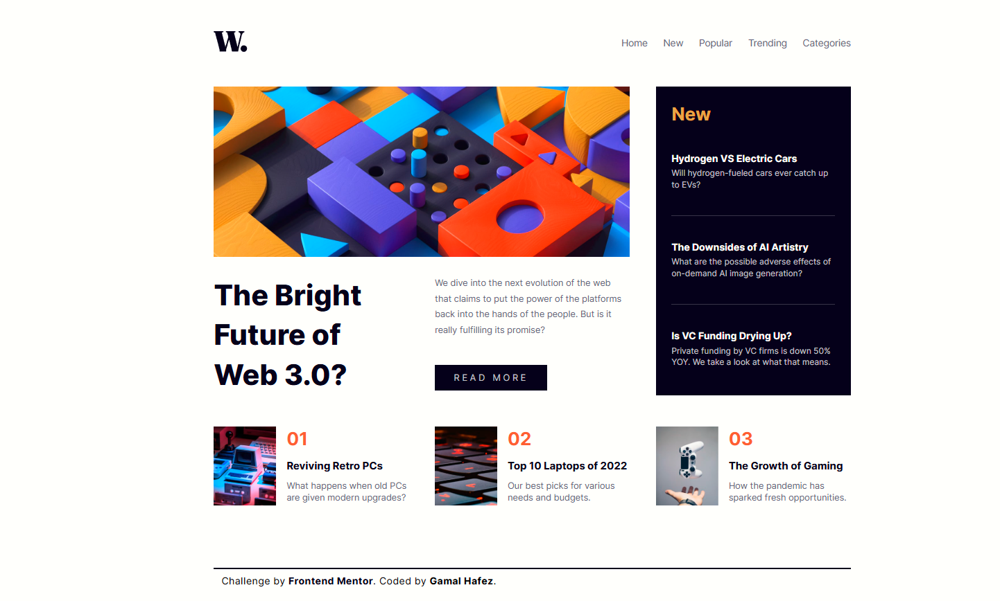

# Frontend Mentor - News Homepage

This is a solution to the [News Homepage challenge](https://www.frontendmentor.io/challenges/news-homepage-H6SWTa1MFl) on Frontend Mentor. This challenge focuses on building a responsive news layout using semantic HTML and modern CSS techniques like Flexbox and Grid.

---

## 📸 Screenshot

---

## 🔗 Live Site

👉 [View Live Site](https://gamalhafez.github.io/news-homepage-challenge/)

---

## 🛠️ Built With

- Semantic HTML5
- CSS3 (Flexbox, Grid, Responsive Design)

---

## 💡 What I Learned

- Creating responsive layouts using CSS Grid
- Managing image scaling and media queries
- Structuring headlines and card-based content
